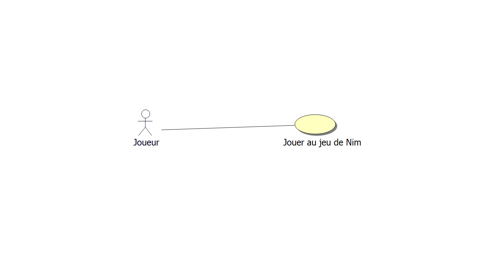
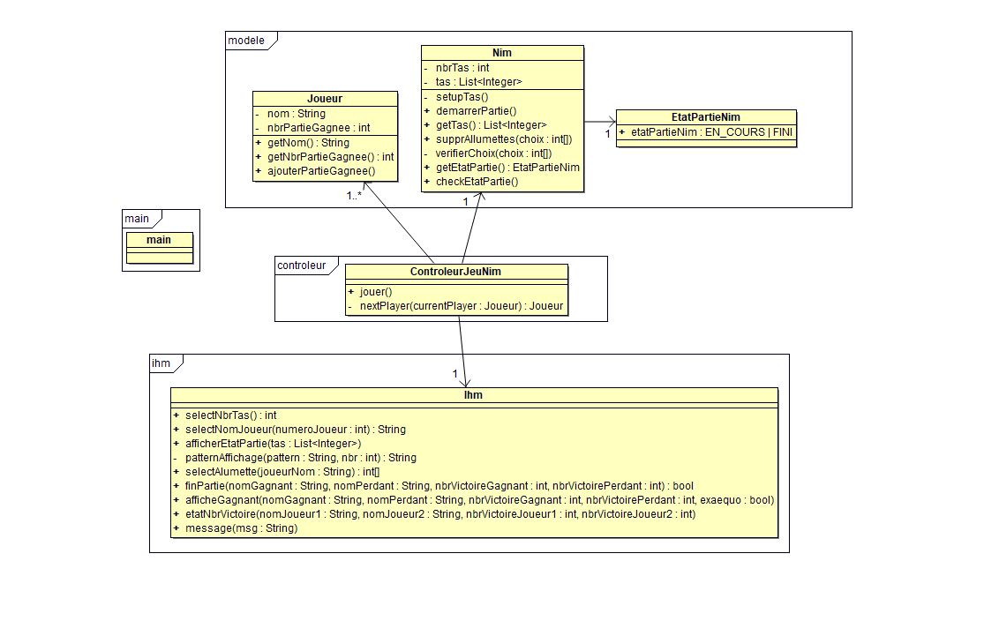

# Rapport de l'itération 1

## Cas d'utilisations

### "Joueur jeu Nim"

**Périmètre :** Système de jeu

**Niveau :** But utilisateur

**Acteur principal :** Les deux joueurs

**Parties prenantes et intérêts :** Les joueurs

**Pré-conditions :** Aucune

**Post-conditions :** Les joueurs ont joué une partie de Nim

**Scénario nominal :**

1. Le système demande aux joueurs de saisir un nombre de tas supérieur
   ou égal à 1.
2. Les joueurs saisissent un nombre de tas.
3. Le système demande le nom du joueur 1.
4. Les joueurs saisissent le nom du joueur 1.
5. Le système demande le nom du joueur 2.
6. Les joueurs saisissent le nom du joueur 2.
7. Le système démarre une partie, le joueur 1 est défini joueur courant
   et commence.
8. Le système affiche l’état de la partie.
9. Le système invite le joueur courant à jouer un coup.
10. Le joueur courant saisit son coup.
11. Le système vérifie l’état de la partie.
12. Le système détermine le vainqueur de la partie et affiche son nom.
13. Le système propose aux joueurs de rejouer.
14. Les joueurs choisissent de ne pas rejouer.
15. Le système affiche le nombre de parties gagnées de chaque joueur.
16. Le système détermine le vainqueur et affiche le nom de celui-ci.

**Extensions :**

- *1.a.* La saisit du nombre de tas est invalide.
    1. Le système affiche l’erreur.
    2. Retour au point 1 du scénario nominal.
- *10.a.* Le coup saisit par le joueur courant est invalide.
    1. Le système affiche l’erreur.
    2. Retour au point 8 du scénario nominal.
- *11.a.* La partie en cours n’est pas terminée.
    1. Le système change le joueur courant.
    2. Retour au point 8 du scénario nominal.
- *14.a.* Les joueurs décident de rejouer une partie.
    1. Retour au point 7 du scénario nominal.
- *16.a.* Les deux joueurs ont le même nombre de victoires.
    1. Le système affiche ex-æquo.

## Modélisation Objet

## Rapport

Pour le projet, nous avons travaillé en commun, collaborant en temps
réel sur tous les endroits du projet.

Cependant, Lucas a été le principal contributeur pour la partie
développement Java, tandis que Younes et Nicolas ont principalement
travaillé sur la partie modélisation et analyse des cas d'utilisation.

Nous avons aussi travaillé en commun pour mettre en place un petit
serveur de collaboration nous permettant de simplifier nos tâches
de développement (automatiquement nettoyer le code).

Nous n'avons pas utilisé d'outils intelligents comme ChatGPT.