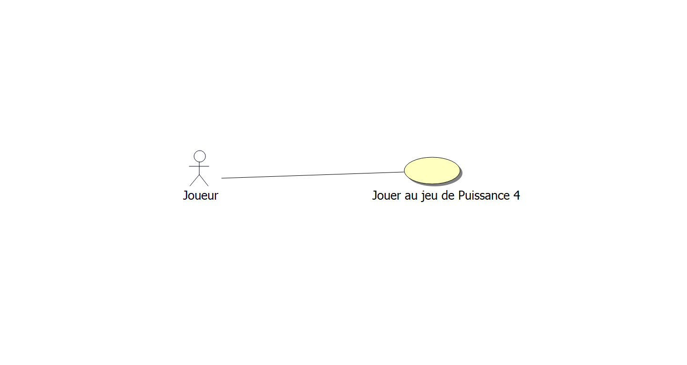
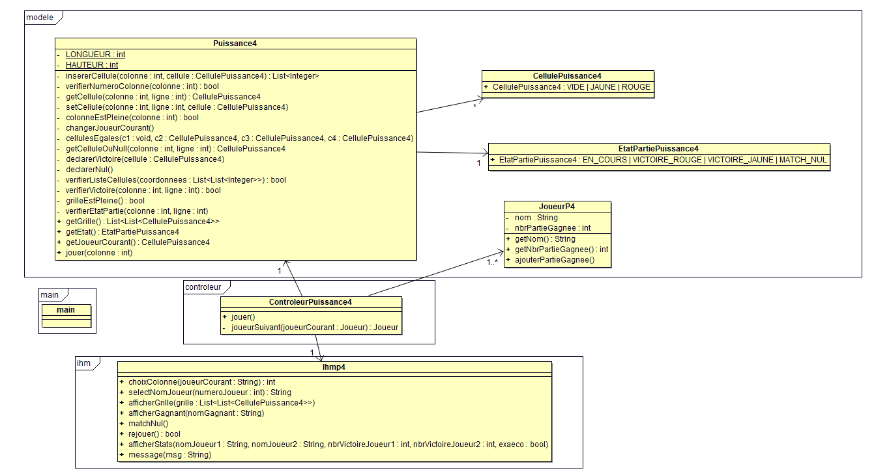

# Rapport de l'itération 2

## Cas d'utilisations

### "Joueur jeu Puissance 4"

**Périmètre :** Système de jeu

**Niveau :** But utilisateur

**Acteur principal :** Les deux joueurs

**Parties prenantes et intérêts :** Les joueurs

**Pré-conditions :** Aucune

**Post-conditions :** Les joueurs ont joué une partie de Puissance 4

**Scénario nominal :**

1. Le système demande aux joueurs de saisir un nombre de tas supérieur
   ou égal à 1.
2. Les joueurs saisissent un nombre de tas.
3. Le système demande le nom du joueur 1.
4. Les joueurs saisissent le nom du joueur 1.
5. Le système demande le nom du joueur 2.
6. Les joueurs saisissent le nom du joueur 2.
7. Le système démarre une partie, le joueur 1 est défini joueur courant
   et commence.
8. Le système affiche l’état de la partie.
9. Le système invite le joueur courant à jouer un coup.
10. Le joueur courant saisit son coup.
11. Le système vérifie l’état de la partie.
12. Le système détermine le vainqueur de la partie et affiche son nom.
13. Le système propose aux joueurs de rejouer.
14. Les joueurs choisissent de ne pas rejouer.
15. Le système affiche le nombre de parties gagnées de chaque joueur.
16. Le système détermine le vainqueur et affiche le nom de celui-ci.

**Extensions :**

- *8.a.* Le coup saisit par le joueur courant est invalide.
    1. Le système affiche l’erreur.
    2. Retour au point 6 du scénario nominal.
- *9.a.* La partie en cours n’est pas terminée.
    1. Le système change le joueur courant.
    2. Retour au point 6 du scénario nominal.
- *10.a.* Le système ne détermine aucun gagnant pour la partie.
    1. Le système affiche que la partie est nulle.
- *12.a.* Les joueurs décident de rejouer une partie.
    1. Retour au point 5 du scénario nominal.
- *14.a.* Les deux joueurs ont le même nombre de victoires.
    1. Le système affiche ex-æquo.

## Modélisation Objet

## Rapport

Lucas a travaillé sur la structure globale et l'architecture des objets du
programme. L'utilité de son travail est de permettre la correction des
problèmes rencontrés lors de la précédente itération, pour permettre la copie
fonctionnelle de Nim pour le développement du Puissance 4.

Nicolas a travaillé sur la logique du jeu du Puissance 4 (backend).

Younes a travaillé sur le contrôleur du jeu et l'affichage des données
(frontend).

Nous avons utilisé l'IA (modèle GPT-4) pour la génération des documentations de
classes et méthodes, en l'intégrant directement à l'éditeur (c.f. GitHub
Copilot).