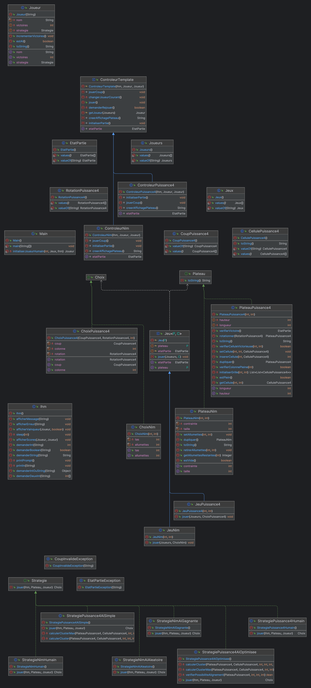

# Rapport de l'itération 4

## Cas d'utilisations

TODO(nc0): uses cases

## Modélisation Objet

## Rapport

- Complétion du paterne Patron de méthode.
- Restructuration des jeux avec des interfaces et protocols communs comme un
  Game Engine.
- Simplification des logiques de jeu et plateaux (-300 LOC dans Puissance 4)
- Création du paterne de stratégie.
- Implémentation de deux stratégies humaines pour faire jouer les joueurs,
  deux stratégies d'IA de Puissance 4 et deux stratégies d'IA de Nim.

Cette itération a pu se faire tranquillement grâce à nos choix architecturaux
passés, qui nous ont permis de simplement effectuer des refactors énormes
rapidement et sans *trop* d'efforts.

En exploitant intensivement les outils de debugging de la plateforme Java
ainsi qu'IntelliJ IDEA, nous avons pu trouver et corriger une énorme quantité
de problèmes d'invariants, de comportements, &c.

Nous avons utilisé l'AI pour la correction de certaines fautes d'orthographes
dans la documentation.